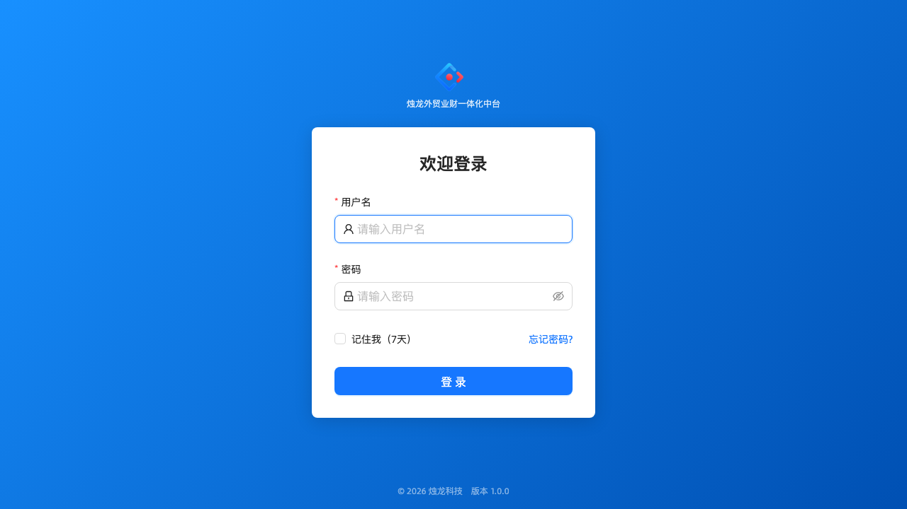
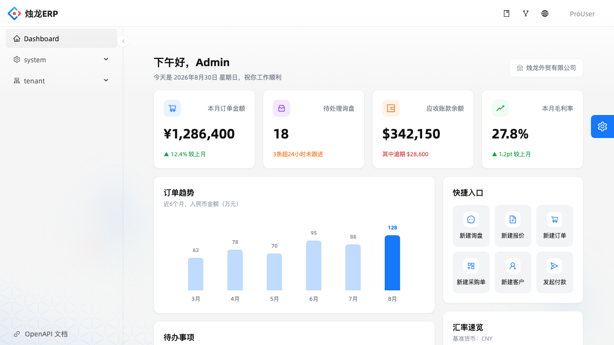

<div align="center">

# 烛龙 ERP · 外贸业财一体化中台

将外贸业务全流程（询报价 → 订单 → 发货 → 收款）与财务系统（应收应付、成本核算、利润分析）深度打通，实现业务与财务实时联动。

[](https://openjdk.org/projects/jdk/17/)
[](https://spring.io/projects/spring-boot)
[](https://nodejs.org)
[](https://pro.ant.design)
[](#license)

</div>

<p align="center">
  
  
</p>

## 功能特性

- **用户登录**：用户名密码登录、记住我（7 天 RefreshToken 静默续期）、连续登录失败自动锁定、忘记密码找回（邮箱验证码）
- **系统管理**：用户 / 角色 / 菜单 / 部门 / 岗位 / 字典管理，操作日志与登录日志（含强制下线）
- **系统设置**：站点名称、Logo、登录背景图等外观自定义（支持图片上传）
- **租户管理**：多租户与租户套餐管理，租户级配置支持共享模板 + 独立覆盖
- **工作台**：外贸业务概览首页（订单趋势、待办事项、汇率速览、在途货物、Top 客户等）
- **权限体系**：基于角色的按钮级权限控制，多租户数据隔离

> 客户管理（CRM）、订单管理（OMS）、应收应付、采购、物流跟踪、成本核算等业务域模块规划见文末 [Roadmap](#roadmap)。

## 技术栈

| 分类 | 技术选型 |
|------|---------|
| 后端框架 | Spring Boot 3.2.5 + Java 17 |
| 持久层 | MyBatis-Plus 3.5.6 + MySQL 8 |
| 缓存 | Redis 7（会话、令牌、限流、字典缓存） |
| 鉴权 | Spring Security + JWT（AccessToken + RefreshToken） |
| API 文档 | Knife4j（Swagger UI 增强版） |
| 前端框架 | Ant Design Pro v6 + Umi Max v4 + ProComponents v3 |
| 前端构建 | Utoopack（Turbopack） |
| 代码规范 | Biome（前端）、阿里巴巴 Java 开发手册（后端） |

## 快速开始

### 环境要求

| 依赖 | 版本 |
|------|------|
| JDK | 17 |
| Node.js | ≥ 20 |
| Maven | 3.9+ |
| MySQL | 8.0+ |
| Redis | 6+ |
| Docker（可选，用于一键启动 MySQL / Redis） | 最新稳定版 |

> **macOS + Homebrew 用户注意**：`brew install openjdk` 装的是最新版 JDK（如 26），如果机器上同时装过 `openjdk@17`，默认的 `mvn`/`java` 命令可能解析到新版 JDK，导致 Lombok 注解处理器静默失效（编译报一堆"找不到符号"，看起来像随机的类找不到 getter/setter）。执行 `mvn compile`/`mvn test` 前先 `export JAVA_HOME=$(brew --prefix openjdk@17)` 确认指向 JDK 17。

### 1. 克隆项目

```bash
git clone https://github.com/zhul-cloud/zhul-trade-erp.git
cd zhul-trade-erp
```

### 2. 一键启动依赖环境（MySQL + Redis）

```bash
docker compose up -d
```

首次启动只会创建一个空的 `zhul_erp` 数据库（`MYSQL_DATABASE` 环境变量），表结构和初始化数据不在这一步导入——
交给后端启动时的 Flyway 自动完成，见下一步。

> 没有 Docker？也可以自行安装 MySQL 8 / Redis，不需要手动执行任何 SQL 文件。

### 3. 启动后端

```bash
cd zhul-erp-backend
cp src/main/resources/application-dev.yml.example src/main/resources/application-dev.yml
# 默认配置已匹配 docker-compose 的账号密码，本地开发一般无需修改
mvn spring-boot:run
```

后端启动时 Flyway 会自动建表并导入初始化数据（菜单、内置角色、字典等结构性数据，以及
`application-dev.yml` 里额外开启的示例管理员/平台账号种子），不需要手动执行 SQL 文件。
迁移脚本见 `zhul-erp-backend/src/main/resources/db/migration`（任何环境都会执行）和
`db/dev-data`（仅本地开发，见 `application-dev.yml` 里的 `spring.flyway.locations`）。

后端默认监听 `http://localhost:8080`，接口文档：`http://localhost:8080/doc.html`。

### 4. 启动前端

```bash
cd zhul-erp-frontend
npm install
npm run dev
```

前端默认监听 `http://localhost:8000`，已通过 `config/proxy.ts` 将 `/api` 代理到后端 `8080` 端口。

### 5. 登录体验

浏览器打开 `http://localhost:8000`，使用初始化数据中的示例账号登录：

| 用户名 | 密码 | 说明 |
|--------|------|------|
| `admin` | `admin123` | 租户账号（`tenant_id=1000`），日常业务操作 |
| `platform` | `admin123` | 平台账号（`tenant_id=0`），可维护商品主数据（品牌/品类/系列等全租户共享数据） |

> 这两个账号仅用于本地快速体验，生产环境部署前请务必修改密码或删除示例数据
> （不要在生产环境的 `spring.flyway.locations` 里加 `classpath:db/dev-data`）。

## 项目结构

```
.
├── docker-compose.yml          # 一键启动本地 MySQL（空库）/ Redis
├── zhul-erp-backend/           # Spring Boot 后端
│   └── src/main/
│       ├── java/com/zhul/erp/
│       │   ├── common/         # 通用工具、异常、返回体
│       │   ├── framework/      # 安全、租户上下文、全局配置
│       │   └── modules/        # 业务模块（auth 用户认证、system 系统管理…）
│       └── resources/db/
│           ├── migration/      # Flyway 迁移脚本（建表+结构性种子数据），任何环境都会执行
│           └── dev-data/       # 示例账号等仅本地体验用的种子，只有 application-dev.yml 才加载
├── zhul-erp-frontend/          # Ant Design Pro 前端
│   └── src/
│       ├── pages/              # 页面（按域划分，与后端模块对应）
│       ├── components/         # 通用组件
│       ├── services/           # 接口请求封装
│       └── locales/            # 国际化文案
├── docs/                       # 产品文档
│   ├── 02-产品PRD/              # 需求文档
│   ├── 03-产品原型/              # OpenPencil 原型（.op 源文件 + 效果图）
│   └── 04-数据模型/              # 数据模型说明
└── .claude/                    # AI 辅助开发配置（编码规范、业务上下文、Skill）
```

## 环境变量

后端所有配置均可通过环境变量覆盖 `application.yml` 中的默认值（本地开发推荐直接改 `application-dev.yml`，生产环境用环境变量注入）：

| 变量名 | 说明 | 默认值 |
|--------|------|--------|
| `DB_HOST` / `DB_PORT` / `DB_NAME` | MySQL 地址 | `localhost` / `3306` / `zhul_erp` |
| `DB_USER` / `DB_PASSWORD` | MySQL 账号密码 | `root` / 空 |
| `REDIS_HOST` / `REDIS_PORT` / `REDIS_PASSWORD` | Redis 地址与密码 | `localhost` / `6379` / 空 |
| `JWT_SECRET` | JWT 签名密钥，**生产环境必须替换** | 内置开发默认值 |
| `AES_KEY` | 敏感配置字段加密密钥，**生产环境必须替换** | 内置开发默认值 |
| `UPLOAD_DIR` | 图片上传存储目录 | `./uploads` |

## 常用命令

```bash
# 后端
cd zhul-erp-backend
mvn spring-boot:run       # 启动开发服务
mvn clean package         # 打包

# 后端测试（本机 Maven 默认会拿到更高版本的 JDK，先 source 这个脚本固定为 JDK 17，并检查 MySQL / Redis）
source scripts/dev-env.sh
mvn -q -o test -Dtest='Product*Test'

# 集成测试用独立的 zhul_erp_test 库（不会碰开发库），Flyway 会在测试上下文启动时自动建表，
# 不需要手动建库。迁移脚本改坏了想彻底重来，删库重建：sql/build/test/reset-test-db.sh
mvn -q -o test -Dtest=IntegrationTestSmokeTest

# 前端
cd zhul-erp-frontend
npm run dev                # 启动开发服务（不带 mock）
npm run build               # 生产构建
npm run lint                 # Biome + TypeScript 检查
npm test                     # 单元测试
```

## 开发文档

- `.claude/CLAUDE.md`：项目专属编码规则（金额精度、软删除、多租户等强约束）
- `.claude/context/`：外贸业务术语、财务科目、数据模型、技术选型说明
- `docs/02-产品PRD/`：各模块产品需求文档
- `docs/03-产品原型/`：OpenPencil 可编辑原型源文件与效果图

## Roadmap

| 模块 | 说明 | 优先级 |
|------|------|--------|
| 客户管理（CRM） | 客户档案、信用评级、联系人 | P0 |
| 订单管理（OMS） | 合同、订单、状态跟踪 | P0 |
| 应收账款（AR） | 发票、收款、核销、账龄 | P0 |
| 采购管理 | 供应商、采购订单、应付 | P1 |
| 物流跟踪 | 发货单、报关、运输状态 | P1 |
| 成本核算 | 订单成本、毛利分析 | P1 |
| 多币种汇率 | 汇率管理、汇兑损益 | P0 |
| 报表分析 | 利润报表、账龄分析、现金流 | P2 |

## License

Copyright © 2026 烛龙科技. All rights reserved.
